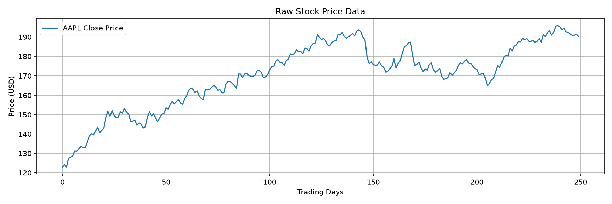
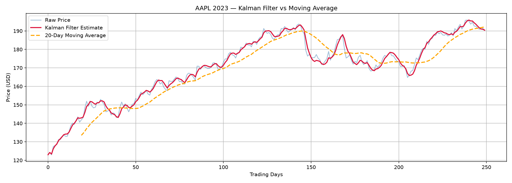
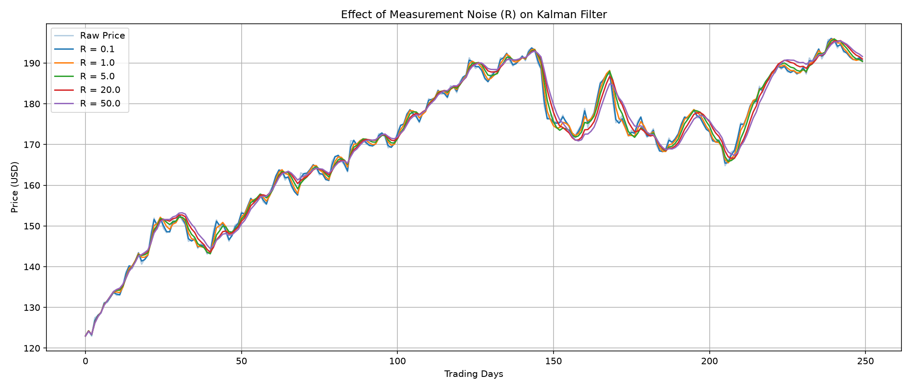
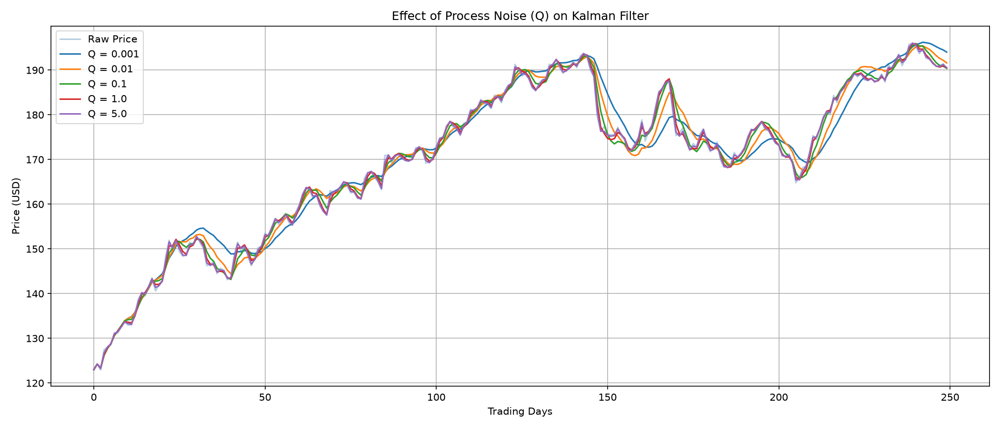

# Kalman Filter for Stock Price Estimation

A Python project applying a **Linear Kalman Filter** to estimate the true underlying
trend of a noisy stock price series, benchmarked against a 20-day Moving Average.

---

## Motivation
Having built an **Extended Kalman Filter** for robot state estimation in MATLAB,
this project applies the same mathematical framework to financial time series —
demonstrating cross-domain transferability of state estimation concepts.

---

## Raw Stock Data (AAPL 2023)

---

## Kalman Filter vs Moving Average

The Kalman Filter reacts faster to price changes while smoothing out noise —
unlike the Moving Average which lags significantly during sharp movements (e.g. day 150).

---

## Quantitative Results
| Metric | Kalman Filter | 20-Day Moving Average |
|--------|--------------|----------------|
| MAE    | 1.1832       | 4.8089         |
| RMSE   | 1.5367       | 5.7520         |
| Std Dev| 1.5364       | 5.2825         |

> The Kalman Filter tracks the true price **~4x more accurately** than a Moving Average.

---

## Tech Stack
`Python` `NumPy` `Pandas` `Matplotlib` `yfinance` `filterpy`

---

## Connection to Robotics
This project uses the **same state-space math** as EKF-based robot localization:
- State vector: price + velocity
- Measurement noise matrix **R** — distrust in raw observed price
- Process noise matrix **Q** — how much the true price can evolve each step

---

---

## Noise Sensitivity Analysis

A key insight of the Kalman Filter is the tradeoff between two noise parameters:

**Measurement Noise (R)** — how much we distrust the raw observed price.
Higher R produces a smoother estimate but reacts more slowly to real price changes.

**Process Noise (Q)** — how much the true price is allowed to evolve each step.
Higher Q makes the filter more responsive but also more sensitive to noise.
Low Q causes the filter to over-smooth and miss sharp movements (visible at day 150).

Tuning R and Q is analogous to tuning a control system — a direct parallel to the EKF
parameter tuning done in the robot state estimation project.

## Resume Keywords
`Kalman Filter` `State Estimation` `Signal Processing` `Time-Series Filtering` `Sensor Fusion` `Financial Modeling`